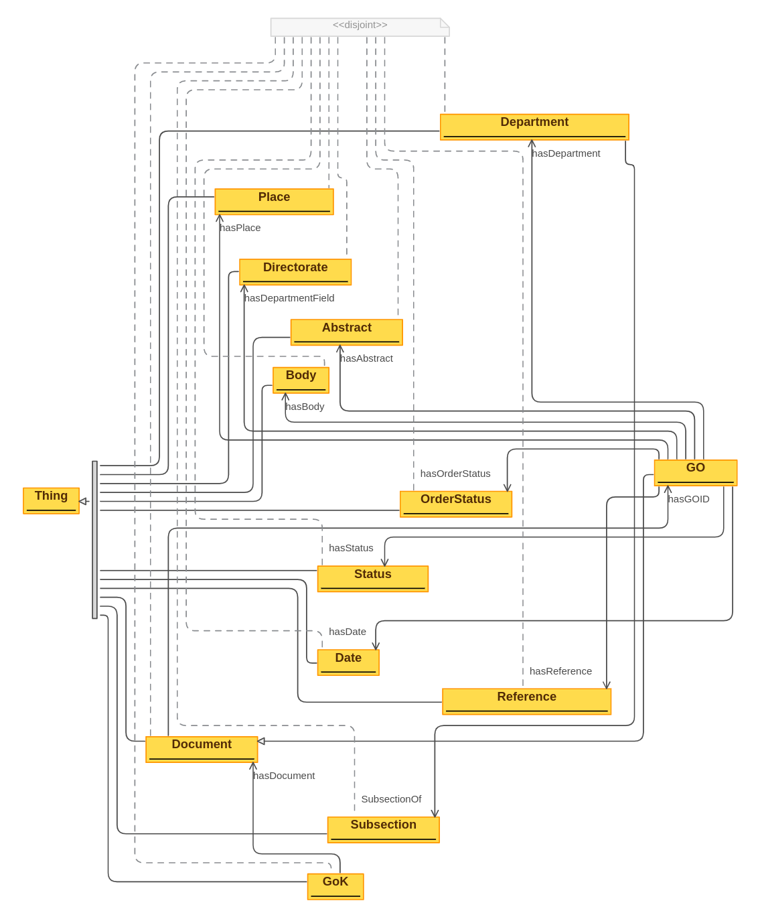

# Govt Order Knowledge Graph
Repo for Mini Project

## Ontology

## Stage 1: Information Extraction
Stage 1 is divided into the following steps:-
- Extracting the text from scanned pdf documents. 
- Using the pattern in the document/textual data, writing regular expression for extracting the relevant sections from the document separately. 
- Severance of the extracted information into more meaningful entity. 
  

## Stage 2: Creation of knowledge graph
- Preparing the extracted json data for import.
- Mapping the data on the ontology.

### Imported Data

- Unmapped

 
- Mapped to ontology

### Classes Defined

### Relations

## Stage 3: Web Interface for querying knowledge graph
- Connection with graph database and defining different queries on graph database.
- Using flask to create web interface and display result based on user search query. 

## Web Interface

